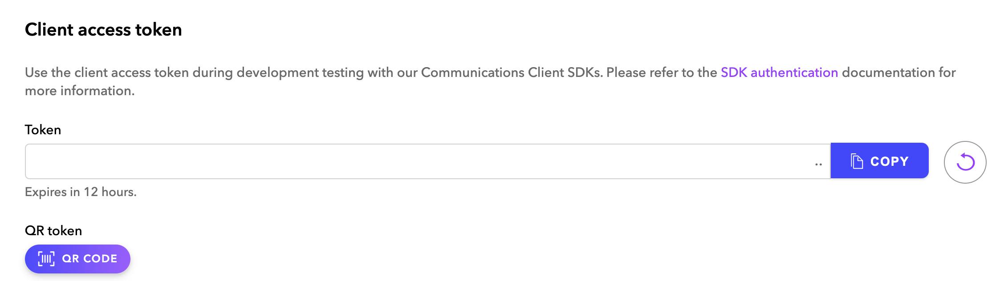
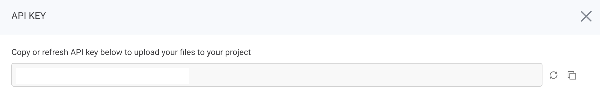

# :warning: This repository is no longer maintained :warning:

# Audio Moderation In Conference Using Hive.ai And The Dolby.io Web SDK
This repository illustrates how to integrate Hive AI and the Dolby.io Android SDK to implement conference monitoring during conferences.

# Overview
This repository contains a sample application for the blog post [Add Conference Audio Moderation Using Hive.ai and the Dolby.io Android SDK](https://dolby.io/blog/add-conference-audio-moderation-using-hive-ai-and-the-dolby-io-android-sdk/). It explains how to use [Hive Audio Moderation](https://hivemoderation.com/audio-moderation) to capture raw local audio from Dolby.io conference, transcribe raw audio into human readable text, process the full transcription and detects inappropriate content across multiple classes.

# Requirements
If you do not have one already, create an account on [Dolby.io](https://dolby.io/) and retrieve a client access token by connecting to your dashboard and selecting your application then click on API keys in the left menu.

Then, create a [Hive](https://thehive.ai) account if you do not have one already and [Request a Demo](https://hivemoderation.com/contact-us?source=hivemoderation-header)

When you have access to to your dashboard, create a project and get your `Hive API Key`.

# Getting Started

Open the project in Android Studio.
Update Configuration.kt with Dolby.io Client Access Token and Hive API Key.
Build the project and run it in a physical mobile device.

# Report a Bug 
In the case any bugs occur, report it using Github issues, and we will see to it. 

# Forking
We welcome your interest in trying to experiment with our repos.

# Feedback 
If there are any suggestions or if you would like to deliver any positive notes, feel free to open an issue and let us know!

# Learn More
For a deeper dive, we welcome you to review the following:
 - [Communications API](https://docs.dolby.io/communications-apis/docs)
 - [Getting Started with Android SDK](https://docs.dolby.io/communications-apis/docs/getting-started-with-android)
 - [How to Screen Capture for Streaming in JavaScript](https://dolby.io/blog/how-to-screen-capture-for-streaming-in-javascript/)
 - [Using Deep Learning for Understanding the Perception of Audio Quality](https://dolby.io/blog/using-deep-learning-for-understanding-the-perception-of-audio-quality/)
 - [Processing Collections of Archival Audio Recordings](https://dolby.io/blog/analyzing-and-enhancing-archival-recording-collections/)

# About Dolby.io
Using decades of Dolby's research in sight and sound technology, Dolby.io provides APIs to integrate real-time streaming, voice & video communications, and file-based media processing into your applications. [Sign up for a free account](https://dashboard.dolby.io/signup/) to get started building the next generation of immersive, interactive, and social apps.

  
&nbsp; &nbsp; &nbsp;
  
&nbsp; &nbsp; &nbsp;
  

&nbsp; &nbsp; &nbsp;
  
&nbsp; &nbsp; &nbsp; 
  
&nbsp; &nbsp; &nbsp;
  

